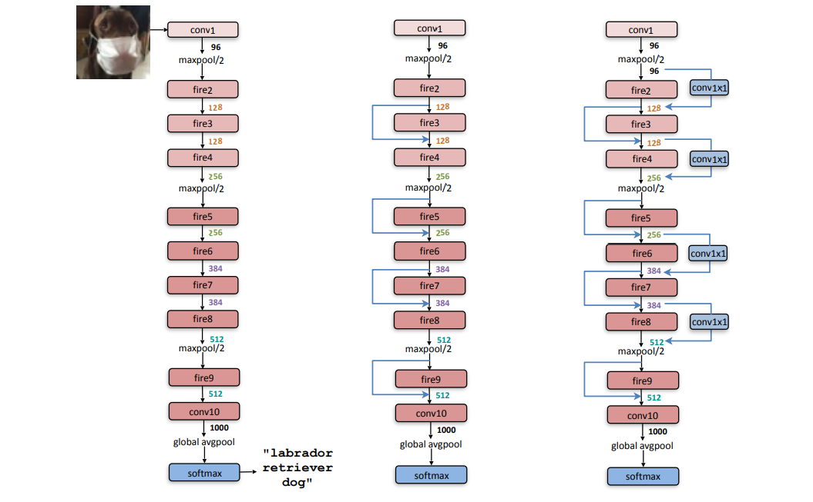

# SqueezeNet
***
> [SqueezeNet: AlexNet-level accuracy with 50x fewer parameters and <0.5MB model size](https://arxiv.org/pdf/1602.07360.pdf)

## Introduction
***
SqueezeNet is a smaller CNN architectures which is comprised mainly of Fire modules and it achieves AlexNet-level accuracy on ImageNet with 50x fewer parameters.  SqueezeNet can offer at least three advantages: (1) Smaller CNNs require less communication across servers during distributed training. (2) Smaller CNNs require less bandwidth to export a new model from the cloud to an autonomous car. (3) Smaller CNNs are more feasible to deploy on FPGAs and other hardware with limited memory. Additionally, with model compression techniques, SqueezeNet is able to be  compressed to less than 0.5MB (510× smaller than AlexNet). Blow is macroarchitectural view of SqueezeNet architecture. Left: SqueezeNet ; Middle: SqueezeNet with simple bypass; Right: SqueezeNet with complex bypass .




## Benchmark
***

|        |              |           |           |    Pynative     |  Pynative  |     Graph      |   Graph    |           |            |
| :----: | ------------ | :-------: | :-------: | :-------------: | :--------: | :------------: | :--------: | :-------: | :--------: |
|        | Model        | Top-1 (%) | Top-5 (%) | train (s/epoch) | Infer (ms) | train(s/epoch) | Infer (ms) | Download  |   Config   |
| GPU | squeezenet_1.0 | 59.48 | 81.22 |  |  |  |  | [model]() | [config]() |
| Ascend | squeezenet_1.0 |   59.49   | 81.22 |  |  |  |  |  |  |
|  GPU   | squeezenet_1.1 | 58.99 | 80.98 |                 |            |                |            | [model]() | [config]() |
| Ascend | squeezenet_1.1 | 58.99 |   80.99   |                 |            |                |            |           |            |


## Examples

***

### Train

- The [yaml config files](../../config) that yield competitive results on ImageNet for different models are listed in the `config` folder. To trigger training using preset yaml config. 

  ```shell
  coming soon
  ```


- Here is the example for finetuning a pretrained squeezenet_1.0 on CIFAR10 dataset using Adam optimizer.

  ```shell
  python train.py --model=squeezenet1_0 --pretrained --opt=momentum --lr=0.001 dataset=cifar10 --num_classes=10 --dataset_download
  ```

Detailed adjustable parameters and their default value can be seen in [config.py](../../config.py).

### Eval

- To validate the model, you can use `validate.py`. Here is an example for squeezenet_1.0 to verify the accuracy of pretrained weights.

  ```shell
  python validate.py --model=squeezenet1_0 --dataset=imagenet --val_split=val --pretrained
  ```

- To validate the model, you can use `validate.py`. Here is an example for squeezenet_1.0 to verify the accuracy of your training.

  ```python
  python validate.py --model=squeezenet1_0 --dataset=imagenet --val_split=val --ckpt_path='./ckpt/squeezenet_1.0-best.ckpt'
  ```

